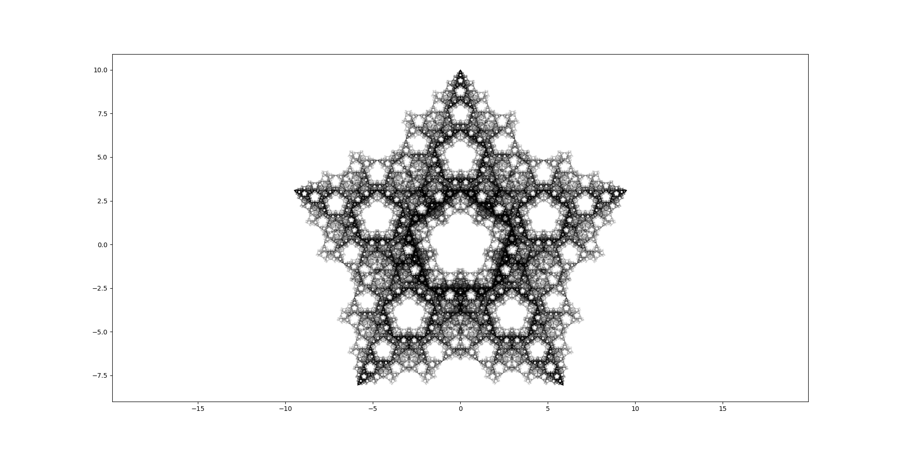

# Chaos game
The [chaos game](https://en.wikipedia.org/wiki/Chaos_game) is a method of generating the [attractor](https://en.wikipedia.org/wiki/Attractor) of an iterated function system using a polygon and a random starting point. The point repeatedly jumps to a location between itself and a random vertex of the polygon. Repeating this for many iterations and points results in the points evolving into a [strange attractor](https://en.wikipedia.org/wiki/Attractor#Strange_attractor), forming fractal structures. Restrictions or rules can be implemented to the selection of vertices to create a wider variety of fractals.

## Prerequisites
To run this chaos game simulation, the matplotlib library is required. This can be installed with pip: ```pip install matplotlib```

## Sierpinski triangle
This is the famous Sierpinski triangle fractal created using a regular polygon with 3 vertices and the point jumping half way to a random vertex with every iteration.


## Pentagonal fractal (star)
This pentagonal, star-shaped fractal is generated using a regular polygon with 5 vertices. The random point jumps half way to a random vertex, but with a restriction on the selection of the vertex: the currently selected vertex cannot neighbour the previously selected vertex if the two previously selected vertices are the same.


## Square fractal
This square-shaped fractal is generated using a regular polygon with 4 vertices. The random point jumps half way to a random vertex, but with a restriction on the selection of the vertex: the currently selected vertex cannot neighbour the previously selected vertex if the two previously selected vertices are the same.


All of the images above were generated using my version of the chaos game with 10 million points. On a 1080p monitor, I have found that the fractal pattern begins to emerge at ~300,000 points and produces the best result at ~10,000,000 points, after which there is no noticeable difference other than the fractal, especially the densest areas, becoming darker due to more layers of semi-transparent points.

These are just some examples of the possible fractals that can be created using the chaos game. With different polygons, jump distances and restrictions, many more fractals can be generated.